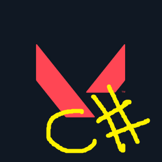

<a name="readme-top"></a>

[![Contributors][contributors-shield]][contributors-url]
[![Forks][forks-shield]][forks-url]
[![Stargazers][stars-shield]][stars-url]
[![Issues][issues-shield]][issues-url]
[![MIT License][license-shield]][license-url]


<!-- PROJECT LOGO -->
<br />
<div align="center">
  <a href="https://github.com/captainqwerty/ValorantAPIWrapper">
    
  </a>

<h3 align="center">Valorant API Wrapper</h3>

  <p align="center">
    A .NET wrapper for valorant-api.com
    <br />
    <a href="https://github.com/CaptainQwerty/ValorantAPIWrapper"><strong>Explore the docs »</strong></a>
    <br />
    <br />
    <a href="https://github.com/CaptainQwerty/ValorantAPIWrapper">View Demo</a>
    ·
    <a href="https://github.com/CaptainQwerty/ValorantAPIWrapper/issues">Report Bug</a>
    ·
    <a href="https://github.com/CaptainQwerty/ValorantAPIWrapper/issues">Request Feature</a>
  </p>
</div>


## About The Project

A very simple project to help developers take advantage of the excellent work done by the Valorant-API.com - giving easy access to a portition of the more common parts of the Valorant-API as well as some additional functionality. 

ValorantAPIWrapper is not official and not endorsed by Riot Games in any way.
Riot Games, Valorant, and all associated properties are trademarks or registered trademarks of Riot Games, Inc.

<p align="right">(<a href="#readme-top">back to top</a>)</p>

<!-- GETTING STARTED -->
## Getting Started

Here you can find the prerequisites and installation instructions.

### Prerequisites

* [Newtonsoft.Json](https://www.nuget.org/packages/Newtonsoft.Json/)
* .NET 6.0

<p align="right">(<a href="#readme-top">back to top</a>)</p>

## Installation

### NutGet Installation
Coming soon

### Manual Installation
Download the [latest release](https://github.com/captainqwerty/ValorantAPIWrapper/releases), extract the .dll file and reference it in your project.

<p align="right">(<a href="#readme-top">back to top</a>)</p>


<!-- USAGE EXAMPLES -->
## Features Usage Examples

After installing the package you can follow any of the below examples to get started.

### Agents


```csharp
// Get a list of all playable agents in Valorant
var allAgents = await Agents.GetAllAgents();

foreach(var agent in allAgents) {
    agent.displayName
}
```


```csharp
// Search for an agent by name
var searchResult = await Agents.GetAgentByName("Jett");

foreach(var ability in searchResult.abilities) {
    ability.displayName
    ability.description
}
```

```csharp
// Get a random playable agent
var randomAgent = await Agents.GetRandomAgent();

foreach(var agent in allAgents) {
    agent.displayName
}
```

```csharp
// Get a set amount of random agents - if no number is specified a single agent is returned
var randomAgents = await Agents.GetRandomAgents(5);

foreach(var agent in randomAgents) {
    agent.displayName
    agent.descritpion
}
```

The agent models returned contain the following data

```csharp
public class AgentModel
{
    public string uuid { get; set; }
    public string displayName { get; set; }
    public string description { get; set; }
    public string developerName { get; set; }
    public string displayIcon { get; set; }
    public string displayIconSmall { get; set; }
    public Role role { get; set; }
    public List<Ability> abilities { get; set; }
    public VoiceLine voiceLine { get; set; }
}

public class MediaList
{
    public int id { get; set; }
    public string wwise { get; set; }
    public string wave { get; set; }
}

public class VoiceLine
{
    public double minDuration { get; set; }
    public double maxDuration { get; set; }
    public List<MediaList> mediaList { get; set; }
}

public class Ability
{
    public string displayName { get; set; }
    public string description { get; set; }
    public string displayIcon { get; set; }
}

public class Role
{
    public string uuid { get; set; }
    public string displayName { get; set; }
    public string description { get; set; }
    public string displayIcon { get; set; }
    public string assetPath { get; set; }
}
```

### Maps

```csharp
// Get a list of all maps in Valorant
var allMaps = await Maps.GetAllMaps();

foreach(var map in allMaps) {
    map.displayName
}
```

```csharp
// Search for a map by name
var searchResult = await Maps.GetMapByName("Ascent");

searchResult.displayName
searchResult.coordinates
```

```csharp
// Get a random map
var randomMap = await Maps.GetRandomMap();

randomMap.displayName
randomMap.coordinates
```

```csharp
 public class MapModel
{
    public string uuid { get; set; }
    public string displayName { get; set; }
    public string coordinates { get; set; }
    public string displayIcon { get; set; }
    public string listViewIcon { get; set; }
    public string splash { get; set; }
    public string assetPath { get; set; }
    public string mapUrl { get; set; }
    public double xMultiplier { get; set; }
    public double yMultiplier { get; set; }
    public double xScalarToAdd { get; set; }
    public double yScalarToAdd { get; set; }
    public List<Callout> callouts { get; set; }
}

public class Callout
{
    public string regionName { get; set; }
    public string superRegionName { get; set; }
    public Location location { get; set; }
}

public class Location
{
    public double x { get; set; }
    public double y { get; set; }
}
```

### Weapons

```csharp
// Get a list of all weapons in Valorant
var allWeapons = await Weapons.GetAllWeapons();

foreach (var weapon in allWeapons) {
    weapon.displayName
    weapon.uuid
}
```

```csharp
// Search for a weapon by name
var searchResult = await Weapons.GetWeaponByName("Vandal");

searchResult.displayName
searchResult.DamageRange.headDamage
```

```csharp
public class AdsStats
{
    public double zoomMultiplier { get; set; }
    public double fireRate { get; set; }
    public double runSpeedMultiplier { get; set; }
    public int burstCount { get; set; }
    public double firstBulletAccuracy { get; set; }
}

public class AirBurstStats
{
    public int shotgunPelletCount { get; set; }
    public double burstDistance { get; set; }
}

public class AltShotgunStats
{
    public int shotgunPelletCount { get; set; }
    public double burstRate { get; set; }
}

public class Chroma
{
    public string uuid { get; set; }
    public string displayName { get; set; }
    public string displayIcon { get; set; }
    public string fullRender { get; set; }
    public string swatch { get; set; }
    public string streamedVideo { get; set; }
    public string assetPath { get; set; }
}

public class DamageRange
{
    public int rangeStartMeters { get; set; }
    public int rangeEndMeters { get; set; }
    public double headDamage { get; set; }
    public int bodyDamage { get; set; }
    public double legDamage { get; set; }
}

public class WeaponModel
{
    public string uuid { get; set; }
    public string displayName { get; set; }
    public string category { get; set; }
    public string defaultSkinUuid { get; set; }
    public string displayIcon { get; set; }
    public string killStreamIcon { get; set; }
    public string assetPath { get; set; }
    public WeaponStats weaponStats { get; set; }
    public ShopData shopData { get; set; }
    public List<Skin> skins { get; set; }
}

public class GridPosition
{
    public int row { get; set; }
    public int column { get; set; }
}

public class Level
{
    public string uuid { get; set; }
    public string displayName { get; set; }
    public string levelItem { get; set; }
    public string displayIcon { get; set; }
    public string streamedVideo { get; set; }
    public string assetPath { get; set; }
}

public class Root
{
    public int status { get; set; }
    public List<WeaponModel> data { get; set; }
}

public class ShopData
{
    public int cost { get; set; }
    public string category { get; set; }
    public string categoryText { get; set; }
    public GridPosition gridPosition { get; set; }
    public bool canBeTrashed { get; set; }
    public object image { get; set; }
    public string newImage { get; set; }
    public object newImage2 { get; set; }
    public string assetPath { get; set; }
}

public class Skin
{
    public string uuid { get; set; }
    public string displayName { get; set; }
    public string themeUuid { get; set; }
    public string contentTierUuid { get; set; }
    public string displayIcon { get; set; }
    public string wallpaper { get; set; }
    public string assetPath { get; set; }
    public List<Chroma> chromas { get; set; }
    public List<Level> levels { get; set; }
}

public class WeaponStats
{
    public double fireRate { get; set; }
    public int magazineSize { get; set; }
    public double runSpeedMultiplier { get; set; }
    public double equipTimeSeconds { get; set; }
    public double reloadTimeSeconds { get; set; }
    public double firstBulletAccuracy { get; set; }
    public int shotgunPelletCount { get; set; }
    public string wallPenetration { get; set; }
    public string feature { get; set; }
    public string fireMode { get; set; }
    public string altFireType { get; set; }
    public AdsStats adsStats { get; set; }
    public AltShotgunStats altShotgunStats { get; set; }
    public AirBurstStats airBurstStats { get; set; }
    public List<DamageRange> damageRanges { get; set; }
}
```

_For more examples, please refer to the [Documentation](https://example.com)_

<p align="right">(<a href="#readme-top">back to top</a>)</p>

<!-- LICENSE -->
## License

Distributed under the MIT License. See `LICENSE.txt` for more information.

<p align="right">(<a href="#readme-top">back to top</a>)</p>

## Acknowledgments

* [Valorant-API.com](https://valorant-api.com/)
* [Best-README-Template](https://github.com/othneildrew/Best-README-Template) - [Othneildrew](https://github.com/othneildrew/)

<p align="right">(<a href="#readme-top">back to top</a>)</p>

<!-- MARKDOWN LINKS & IMAGES -->
<!-- https://www.markdownguide.org/basic-syntax/#reference-style-links -->
[contributors-shield]: https://img.shields.io/github/contributors/CaptainQwerty/ValorantAPIWrapper.svg?style=for-the-badge
[contributors-url]: https://github.com/CaptainQwerty/ValorantAPIWrapper/graphs/contributors
[forks-shield]: https://img.shields.io/github/forks/CaptainQwerty/ValorantAPIWrapper.svg?style=for-the-badge
[forks-url]: https://github.com/CaptainQwerty/ValorantAPIWrapper/network/members
[stars-shield]: https://img.shields.io/github/stars/CaptainQwerty/ValorantAPIWrapper.svg?style=for-the-badge
[stars-url]: https://github.com/CaptainQwerty/ValorantAPIWrapper/stargazers
[issues-shield]: https://img.shields.io/github/issues/CaptainQwerty/ValorantAPIWrapper.svg?style=for-the-badge
[issues-url]: https://github.com/CaptainQwerty/ValorantAPIWrapper/issues
[license-shield]: https://img.shields.io/github/license/CaptainQwerty/ValorantAPIWrapper.svg?style=for-the-badge
[license-url]: https://github.com/CaptainQwerty/ValorantAPIWrapper/blob/master/LICENSE
[product-screenshot]: images/screenshot.png
